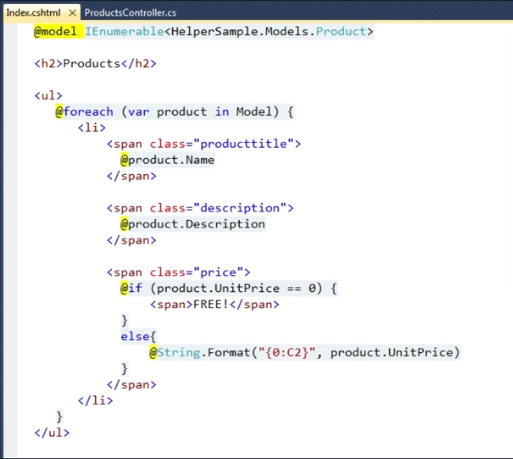
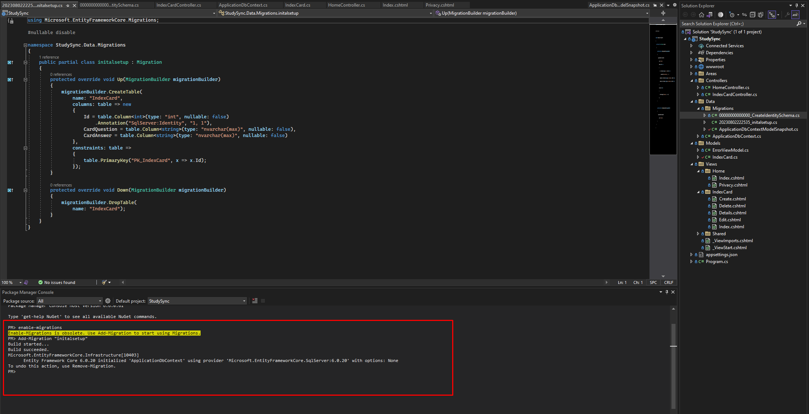
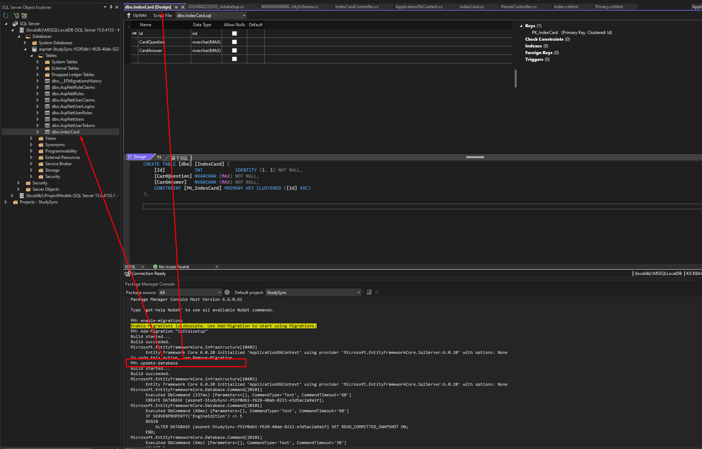
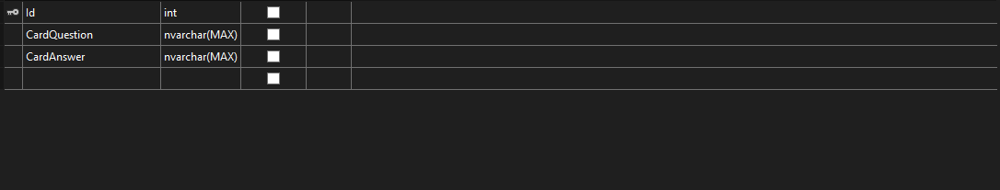

# StudySync
StudySync is an app that syncs all your studying material across all platforms(Windows, Mac, Mobile, Linux). This project utilizes ASP.NET Core and C#.

MVP:
- [x] Add/ delete index cards (basic crud operations) 
- [ ] Account creation 
- [ ] Unable to create index cards unless logged in 
- [ ] Index cards are stored under the logged in account

Long-Term Goals:
- [ ] Build front-end with Javascript and React
- [ ] Containerize and Deploy application with Docker and Kubernetes
- [ ] Build a desktop app version using the [electron framework](https://www.electronjs.org/)
- [ ] Use Grafana for log and metrics aggregation to be able to establish reasonable SLO's. 

# What is ASP.NET Core?
- ASP.NET Core is an open source C# web-development framework for building web apps on the .NET platform.
- ASP or "Active Server Pages" - Dynamic web pages, usually connected to a database.
- ASP.NET Core is a flexible Full Stack solution to DBMS, Business Logic, HTML. It can also be combined with popular front-end services like React, Angular, Vue.
- The .NET framework consists of runtime engine and libraries for executing programs written in a complaint language.
- C# is the most popular programming language to write applications for the .NET framework *(so thats what we'll be using)*. 

*The open-source version of ASP.NET, that runs on macOS, Linux, and Windows.(cross platform)*

An ASP.NET page contains a mix of HTML markup and dynamic ASP markup: 

ASP.NET is run on a server combining the static HTML code, and updating the dynamic ASP elements to produce a final HTML page.

# MVC (Model Views and Controllers)
- Model: classes (objects)
    - For this app I will be creating a model for index cards for studying that has a question, answer, and an Id number.
    - Data related, consisting of classes and objects with properties
    - Uses SQL statements
    - Supplies the controller with lists of objects 
- View: web page (in this context -> Razor HTML)
    - The view will be the web pages that mangages the display of data.
    - HTML/CSS code 
    - Usually gets a list of data from the controller
    - Dynamically combines data with HTML and C# *(called Razor)* in a template
- Controller: connects models, business logic and web pages.
    - The controller handles the code, page events, and navigation.  
- The MVC design pattern helps to enforce separation of concerns to help you avoid mixing presentation logic, business logic, and data access logic together. 
    - This means that we can create apps that optimize space/ file sizes, code is modular, and can be run and managed by multiple people. 

# DAO vs Object Relational Mapper: 
Data Access Object:

- Manually create tables
- Traditional method of database access 
- Write your own SQL statements
- Usually the prefered method
- Provides more visibility on finding problems

Object Relational Mapper:
- Allow the computer to generate database tables based on classes defined in the application
- Database is updated using migrations 
- **Entity Framework** is Microsofts ORM

*Springboot, the Java framework used to build web applications and microservices can utilize both the DAO and ORM methods but is typically based on ORM with the Spring Data JPA.*

- Using the internal Visual Studio Package Manager: "Add-Migrations" to start the ORM.

- Using the package manager: "update-database" to use the ORM to create the user account and index card tables. 

- The table has been created according the properties of the index card.

